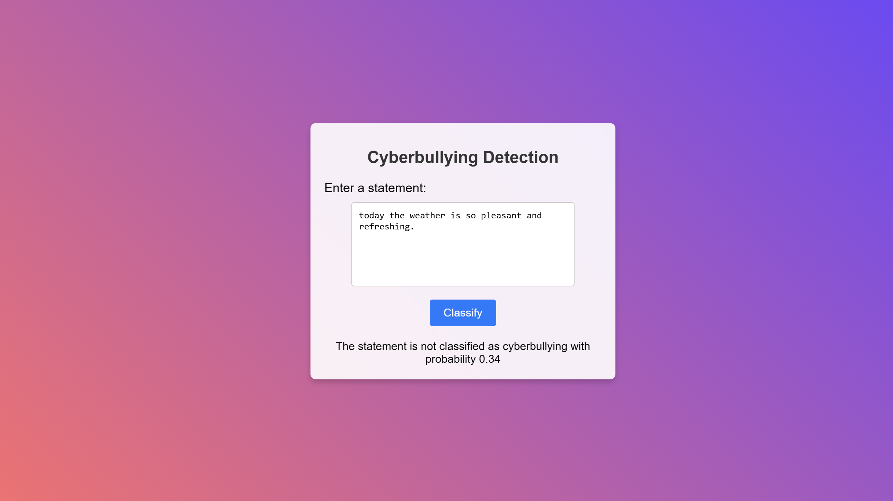
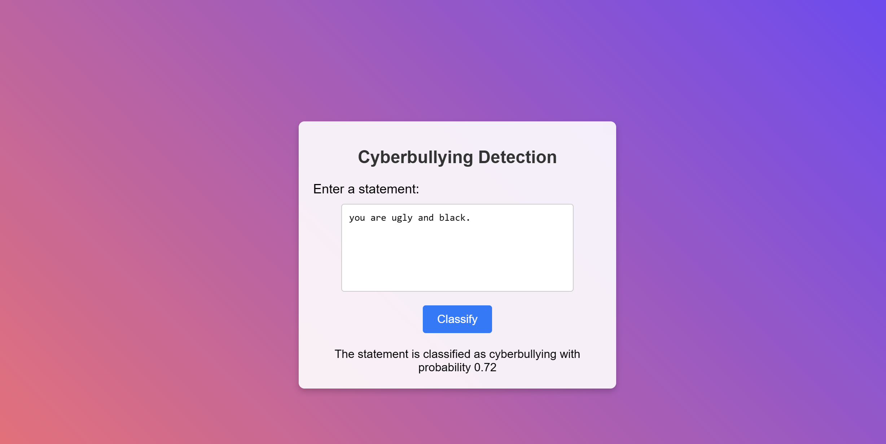

## Introduction

Cyberbullying has become a significant issue with the growing use of online platforms. Harmful comments, hate speech, and offensive language are often directed toward individuals, causing emotional distress and other negative effects. Identifying such harmful content early on is critical to creating a safer and more inclusive online environment.

This project addresses the problem of detecting cyberbullying by leveraging machine learning techniques. The application is designed to classify whether a given statement contains cyberbullying, specifically focusing on offensive language related to ethnicity. By analyzing text data using a Naive Bayes classifier, the model can predict the likelihood of cyberbullying in real-time, providing a useful tool for platforms and communities to monitor harmful content.

The web-based interface allows users to input text and receive predictions regarding its nature, with the application returning both the classification and the associated probability of the statement being considered cyberbullying. This project is a step toward building a more responsible digital space by helping to identify and prevent harmful interactions.

## Features

- **Machine Learning Model**: Uses a Naive Bayes classifier trained on text data.
- **Text Classification**: Classifies input text as cyberbullying or non-cyberbullying.
- **Probability Score**: Provides the likelihood that a given statement contains cyberbullying.
- **Interactive Web Interface**: Users can input text through a web interface to receive classification results.
  
This project is an excellent example of how machine learning can be applied to real-world social issues like online harassment. With further enhancements, the model can be expanded to detect a wide range of cyberbullying categories beyond ethnicity, contributing to safer digital communication.

## Technologies Used

- **Scikit-learn**: Machine learning library used for model training and prediction.
- **Joblib**: Used to serialize and deserialize the trained model and vectorizer.
- **HTML, CSS, JavaScript**: Front-end technologies to build the user interface.

## Project Structure

- `app.py`: The main application that handles requests, loads the machine learning model, and provides predictions.
- `templates/index.html`: The HTML template for the web interface.
- `nb_classifier.pkl`: The trained Naive Bayes model used for prediction.
- `tfidf_vectorizer.pkl`: The TF-IDF vectorizer to convert input text into features.

## Installation

### Prerequisites

Ensure you have Python installed, and install the following packages:

```bash
pip install scikit-learn joblib pandas
```
### Model and Vectorizer
You will need the pre-trained model (nb_classifier.pkl) and the vectorizer (tfidf_vectorizer.pkl). These files are used to load the Naive Bayes classifier and the TF-IDF vectorizer. Ensure these are in the same directory as app.py.

### Running the Application
1. Clone or download this repository.
2. Open a terminal in the project directory and run the following command to start the server:
```bash
python app.py
```
3. Open your browser and navigate to http://127.0.0.1:5000/ to access the web interface.

### How It Works
1. The user enters a statement in the text box provided on the web interface.
2. When the form is submitted, the text is sent to the server.
3. The app.py file processes the input using the loaded TF-IDF vectorizer to convert the text into a feature vector.
4. The Naive Bayes classifier makes a prediction on whether the statement contains cyberbullying content related to ethnicity.
5. The result, along with the probability score, is displayed on the web page.

### Future Improvements
- **Enhanced Model:** Add more categories of cyberbullying beyond ethnicity.
- **Deep Learning:** Implement a deep learning model (e.g., using PyTorch) for better accuracy and scalability.
- **Dataset Expansion:** Train the model on a larger and more diverse dataset to improve classification performance.
- **User Authentication:** Add user authentication for secure access and logging of detected instances.

### Contributing
Feel free to contribute to this project by submitting issues or pull requests. Suggestions for improving the model, UI, or adding new features are welcome.

## Screenshots


<br>
<br>



